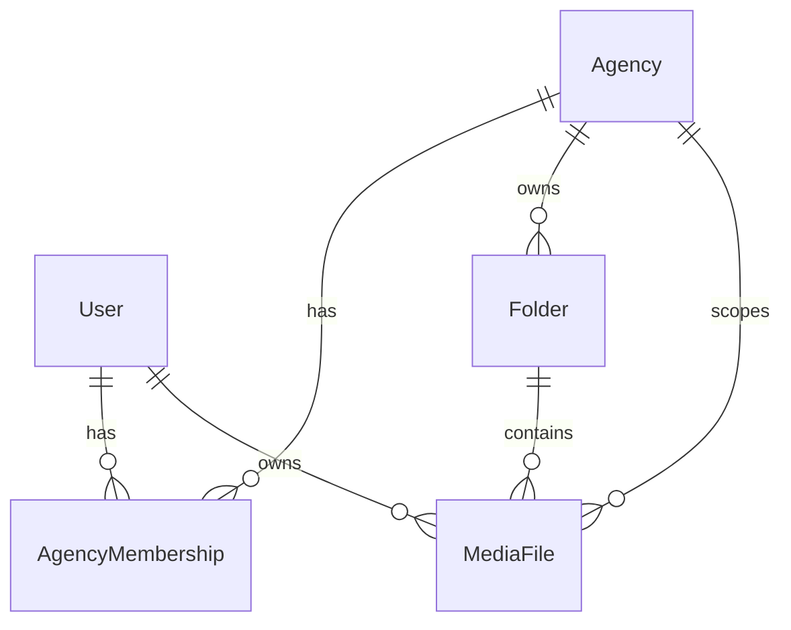

# Agency Member Tab — Implementation Handout

Status: MVP implemented and verified working on a local dev-client build against the local backend.
Scope: CLIENT/MEMBER side only. Agency admin UI and the approve/reject/review workflow are intentionally deferred.

This document spans two repos:
- Mobile: `~/Projects/snapnest` (React Native + Expo Dev Client)
- Backend: `~/Projects/snapnest-backend` (NestJS + Prisma 7, Postgres, Cognito, S3)

---

## 1. What was built

An agency-linked member gets a 5th bottom tab, **Agency** (visible only if they have an agency membership), where they can:
1. Browse their agency's workspace folders.
2. View the media inside those folders (read-only gallery).
3. Submit captures into an agency folder (uploaded media stays member-owned but is tagged with `agencyId`).

Submitted media is isolated from the user's personal Folders/Activity, and agency content is authorized by membership, not personal ownership.

### Two locked product decisions
- Membership provisioning: a minimal ADMIN-guarded endpoint (plus direct DB seeding) attaches a user to an agency.
- Submit semantics: media stays owned by the member, tagged with `agencyId`, placed in an agency folder; agency members read it via agency scope.

---

## 2. Data model (backend)

Migration: `prisma/migrations/20260623190220_add_agency_models/`

New:
- `Agency` — `id`, `name`, timestamps; relations `memberships[]`, `folders[]`, `files[]`.
- `AgencyMembership` — `id`, `agencyId`, `userId`, `role` (`AgencyRole`), timestamps; `@@unique([agencyId, userId])`, indexes on both FKs.
- `AgencyRole` enum — `CLIENT`, `STAFF`.

Changed:
- `Folder` — added `agencyId String?` (+ index, FK `onDelete: Cascade`). Personal folders keep it null; agency folders carry it.
- `MediaFile` — added `agencyId String?` (+ index, FK `onDelete: SetNull`). Set on agency submissions; owner stays the member.



---

## 3. Backend endpoints

New modules: `src/users/` (GET /me), `src/agency/`, `src/admin/`.

- `GET /me` — returns `{ id, email, firstName, accountType, memberships: [{ agencyId, agencyName, role }] }`. This is the agency-linked signal the app reads.
- `GET /agency/:agencyId/folders` — agency workspace folders (membership-gated).
- `GET /agency/folders/:folderId` — folder + its files (membership-gated).
- `POST /files/view-urls` — extended with optional `agencyId`; when present, authorizes by membership instead of ownership.
- `POST /uploads` — extended with optional `agencyId`; validates membership + that the target folder belongs to the agency; sets `MediaFile.agencyId`, owner stays the member.
- ADMIN-only (guarded by `AdminGuard`, requires `accountType === ADMIN`):
  - `POST /admin/agencies` — `{ name }`
  - `POST /admin/agency-memberships` — `{ agencyId, email, role? }` (resolves user by email)
  - `POST /admin/agencies/:agencyId/folders` — `{ name, type? }` (folder for a workspace)

Auth: existing custom `AuthGuard` (Cognito ID token via `aws-jwt-verify`); `@CurrentUserId()` = internal Postgres UUID. The shared authorization gate is `AgencyService.assertAgencyMembership(userId, agencyId)`.

---

## 4. Multi-tenancy / security model

- Every agency read/write passes through `assertAgencyMembership`. Client-supplied `agencyId`/`folderId` are never trusted — folder ownership/agency is re-derived server-side.
- Personal/agency isolation:
  - `GET /folders` and `GET /folders/:id` filter `agencyId: null` (agency folders never leak into personal views).
  - `GET /files` filters `agencyId: null`.
  - Personal `view-urls` restrict to `ownerId === user AND agencyId === null`; agency branch authorizes by membership.
  - Agency files cannot be moved/deleted through the personal `/files` endpoints (guarded).
- S3 keys remain owner-namespaced (`users/${userId}/raw/...`); access is mediated by presigned URLs + the membership check.
- CORS currently allows only `GET`/`POST` (`src/main.ts`). MVP agency traffic is GET/POST, but any future agency PATCH/DELETE will be blocked until this is widened.

---

## 5. Mobile implementation

Data layer:
- `src/services/agencyService.ts` — `getMe`, `getAgencyFolders`, `getAgencyFolderDetails` (+ `Me`, `AgencyFolder`, `AgencyFolderDetails` types).
- Hooks: `src/hooks/useMe.ts`, `useAgencyFolders.ts`, `useAgencyFolderDetails.ts`.
- `getBatchViewUrls` / `useBatchViewUrls` extended with optional `agencyId` (keyed separately).
- Upload pipeline carries agency context: `UploadFileInput.agencyId`, `UploadQueueItem.{agencyId,folderId}`, `uploadManager` forwards them and invalidates `['agency']` on agency uploads. Agency uploads are excluded from the personal Activity feed.

Navigation:
- `mainTabTypes.ts` gains `Agency`.
- `RootNavigator` renders the Agency `Tab.Screen` conditionally from `useMe().memberships`.
- `GlassTabBar` lays out 2-left / FAB / 2-right and drops the Agency route when absent.
- `src/navigation/AgencyStack.tsx` + `agencyTypes.ts` — list to detail via the same state-machine workaround as `FoldersStack` (no native-stack; avoids the iOS New Arch `setColor:` crash).

UI:
- `src/screens/AgencyFoldersScreen.tsx` — read-only workspace folder list (uses first membership).
- `src/screens/AgencyFolderDetailScreen.tsx` — reuses `MediaThumbnailGrid` + the shared `MediaViewerModal`; Submit picks media via `expo-image-picker` and enqueues with `agencyId`/`folderId`.
- `MediaViewerContext` / `MediaViewerModal` gained `agencyId` + `readOnly` options so agency media loads via the agency view-urls branch and the "Move to folder" action is hidden for agency media.

No new native modules were added — JS-only changes ship over Metro to a dev-client build.

---

## 6. How to test locally (the fast loop)

1. Backend: `cd ~/Projects/snapnest-backend && npm run start:dev` (port 3000, watch mode). Uses the RDS dev DB in `.env`; the migration is already applied.
2. Mobile (one-time): a **development** dev-client build is required — `eas device:create` then `eas build -p ios --profile development`; install it.
3. Metro: `cd ~/Projects/snapnest && npx expo start --dev-client` (phone + Mac on same WiFi). The app auto-targets the Mac's LAN IP:3000 (`src/services/api.ts`).
4. Sign in once (creates your `User` row).
5. Seed data with `npx prisma studio`:
   - `Agency` → add `{ name }`, copy `id`.
   - `AgencyMembership` → `{ agencyId, userId = your User.id, role: CLIENT }`.
   - `Folder` → `{ name, ownerId = your User.id, agencyId, type: AGENCY_INTAKE }`.
6. Reload the app → Agency tab appears → open folder → Submit a photo.

Gotcha: the membership `userId` must exactly equal the signed-in user's `User.id`, or the tab won't show.

---

## 7. How to ship to TestFlight (release path)

A TestFlight build is a release bundle (no Metro) and there is no OTA/`expo-updates` configured, so new JS requires a new build.

1. Backend → Railway: commit + push `snapnest-backend`. If Railway's DB differs from the `.env` RDS, run `DATABASE_URL=<railway> npx prisma migrate deploy` once.
2. Mobile: commit + push, then `eas build -p ios --profile preview` (this profile bakes `EXPO_PUBLIC_API_URL=https://snapnest-backend-production.up.railway.app`).
3. Seed agency data in Railway's DB (Prisma Studio pointed at that `DATABASE_URL`).

---

## 8. Getting a Cognito ID token for curl (optional)

The admin endpoints can be exercised with curl if you have an ID token:
```
aws cognito-idp initiate-auth \
  --auth-flow USER_PASSWORD_AUTH \
  --client-id 3j13rj8baaqso9vpbvh9211mq8 \
  --auth-parameters USERNAME=you@x.com,PASSWORD=... \
  --region us-east-2
```
Use `AuthenticationResult.IdToken` as the Bearer token. (Only works if the client allows USER_PASSWORD_AUTH; otherwise seed via Prisma Studio.) To use the admin routes, set one user's `accountType = ADMIN` in the DB first.

---

## 9. Verification done

- Backend: `npm run build` and `npm run lint` clean; server boots with all agency routes mapped; unauthenticated/non-admin requests return 401/403.
- Mobile: `npx tsc --noEmit` clean.
- On-device: Agency tab, folder browse, submit, and personal-isolation confirmed working on a dev-client build.

---

## 10. Deferred / next steps

- Approve/reject/needs-modifications review workflow (schema enums `ReviewStatus`, agency `FolderType`s already exist, no logic yet).
- Agency admin UI (create clients, folders, templates) — only minimal admin endpoints exist today.
- Multi-agency UX (the app currently uses the first membership; pick/switch UI if a user joins multiple agencies).
- In-progress upload feedback inside the agency folder (agency queue items aren't shown until the upload completes and `['agency']` refetches).
- Widen CORS methods before adding any agency PATCH/DELETE.
- Consider agency-namespaced S3 keys (`agencies/${agencyId}/...`) if isolation-at-rest is later required.
- Tests: no automated coverage for the new auth/ownership paths yet.
